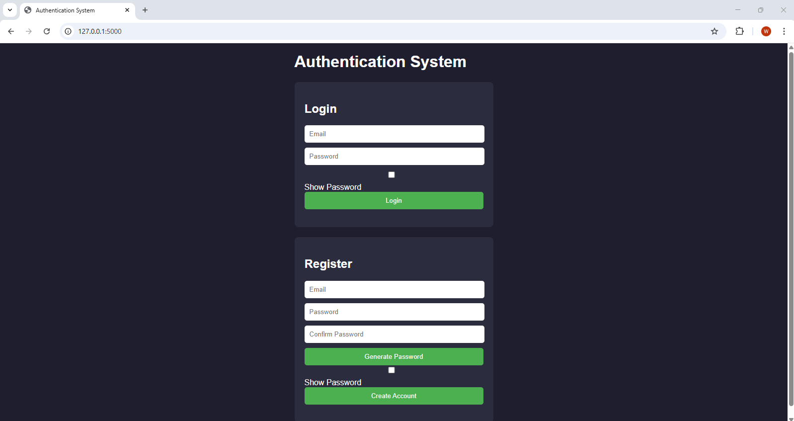
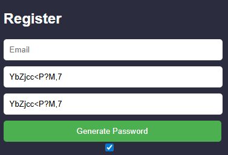
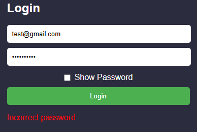

# Authentication System

A full-featured web-based authentication system built with Flask, featuring user registration, secure login, password hashing, and account lockout protection.

## Features

### 🔐 Security
- **Bcrypt Password Hashing**: Passwords are securely hashed using bcrypt with salt generation
- **Password Strength Validation**: Enforces strong passwords requiring:
  - Minimum 8 characters
  - At least one special character (!@#$%^&*()-+?_=,<>/)
  - At least one number
  - At least one letter
- **Account Lockout Protection**: Implements rate limiting with automatic lockout after 3 failed login attempts within a 5-minute window
- **Email Validation**: Validates email format using regex pattern matching

### 👤 User Management
- **User Registration**: Create new accounts with email and password
- **User Login**: Secure login with password verification
- **Password Generation**: Auto-generate strong random passwords
- **Login Logging**: Track all login attempts (success and failure)
- **Failed Attempt Tracking**: Monitor and log failed authentication attempts

### 📊 Data Management
- **CSV-based Storage**: User credentials, logs, and failed attempts stored in CSV files
- **User Data**: Stores email, hashed password, and account creation date
- **Login Logs**: Records email, timestamp, and login result (Success/Fail)
- **Failed Attempts**: Tracks failed login attempts with timestamps for lockout enforcement

### 🎨 User Interface
- **Responsive Web Interface**: Clean, modern UI with dark theme
- **Real-time Feedback**: Instant validation messages for login and registration
- **Password Toggle**: Show/hide password visibility
- **Auto-generated Passwords**: One-click strong password generation for registration

## Technology Stack

- **Backend**: Flask (Python)
- **Password Hashing**: bcrypt
- **Data Storage**: pandas & CSV files
- **Frontend**: HTML, CSS, JavaScript
- **Security**: Regex-based validation, rate limiting

## Screenshots

### Login Page


### Complex Password Generation


### Validation Example


## Project Structure

```
Authentication-System/
│
├── app/
│   ├── app.py               # Main Flask application and route handlers
│   └── auth/
│       ├── __init__.py      # Exposes register, login, generateRandomPassword
│       ├── auth.py          # Core register and login logic
│       ├── config.py        # Constants, file paths, and regex patterns
│       ├── csv_handler.py   # CSV load/save functions
│       ├── validators.py    # Email and password validation
│       ├── password_utils.py # Random password generation
│       ├── rate_limiter.py  # Failed attempt tracking and account lockout
│       └── logger.py        # Login attempt logging
│
├── data/
│   ├── userdata.csv         # User emails, hashed passwords, and creation dates
│   ├── logs.csv             # All login attempts (email, timestamp, success/failure)
│   └── failedattempts.csv   # Failed login attempts for account lockout enforcement
│
├── static/
│   ├── style.css            # Dark theme styling for responsive web interface
│   └── script.js            # Client-side JavaScript for form handling and API calls
│
├── templates/
│   └── index.html           # Main HTML template for Flask
│
├── README.md                # Project documentation
└── .gitignore               # Git ignore rules
```
